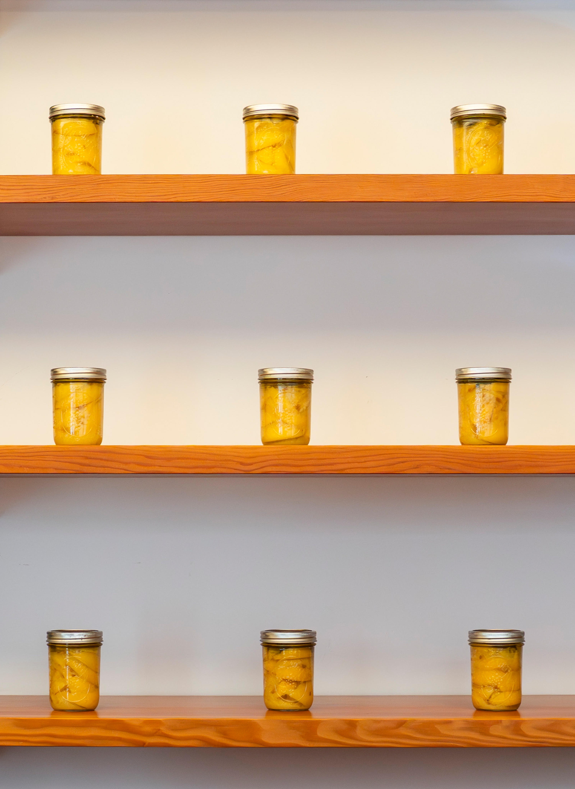

On July 10, Richard Gray Gallery unveiled its latest group show, curated by Dieter Roelstraete and Abigail Winograd, featuring the work of ten conceptualists either based or trained in Chicago. “It’s About Time: Counterproductive Conceptualisms in Chicago” features a double-entendre title that fits the several works oriented toward the passage of time, and the slowness that often runs against the flow of capitalist, urban pressures in a large metropolitan city like Chicago.

Much like Miami, the city where I was born and raised, the surrounding culture—in Chicago’s case the Midwest—has a different relation to time and its passage, a less urgent need to fit as many activities and to-dos within every waking moment, and instead follows the flow of when things are meant to happen. Each of the artists within this exhibition takes that premise to task by reflecting not only on Midwestern sensibilities, but on more universal understandings of divine timing, biological timing or a laissez-faire attitude toward things already overdue.

Behind the front desk, Alex Chitty’s “The time it takes” (February-August 2026) is easily missed amongst the books and shelving behind it—yet it is a profound contemplation on the different dimensions of time. This series of mason jars filled with preserved lemons reminds viewers of a pace that is irrespective of deadlines, schedules or expediency; the lemons inside will ferment at the pace nature demands, and if not used in time will certainly rot on the same natural cycle. The work is especially fitting when you consider Chicago’s presence as an epicenter of America’s agrarian heartland, where science may allow for optimization of yield, but still must follow the ebb and flow of the seasons.

Another work that pulls from a natural and very relatable premise is Miao Wang’s “October 25th, 2025” (2025), a diptych of abstract rust-colored sheets. The color was achieved by mixing watercolor with defrosted breast milk the artist had after giving birth to her child. Parenthood is a profound change in one’s relationship to time, and in the case of a mother, newborn children beget a corporeal relationship to the needs of a child and the times in which those needs must be met. Unfortunately, modern society still fails to come up with a way to bring this timing into its frenetic rhythm without often alienating the mother.

Several works currently on view were made specifically for this exhibition, notably Dave Lloyd’s “IKEA Kitchen in a Bedroom in a Gallery for Fertilized Egg Piece with Abstract Paintings” (2011-2026). The quintessential conceptualist title essentially sums up what the installation is—literally an Ikea kitchen set up in the corner of the gallery with abstract paintings leaning up against the wall on it. What stands out most is the snippet offered by the artist, where he mentions dreaming about this exact installation and only remembering the dream once prompted by the curators; once the work was installed, a leak from the ceiling landed right in the sink.

Over time, I have come to believe in the premise of kismet, the guiding timing that allows things to happen for a person when they are meant to happen, not when the person wants them. When searching for opportunities, goals, life’s next steps, perhaps desires get in the way of the flow that is meant to provide the best outcome. Ultimately, both this work and the exhibition are reminders that timeliness is constructed, that sometimes things really do happen when they are meant to and that measurable time is ultimately arbitrary when compared to lived, present moments.

“It’s About Time: Counterproductive Conceptualisms in Chicago” at Richard Gray Gallery, 2044 West Carroll, through August 22.