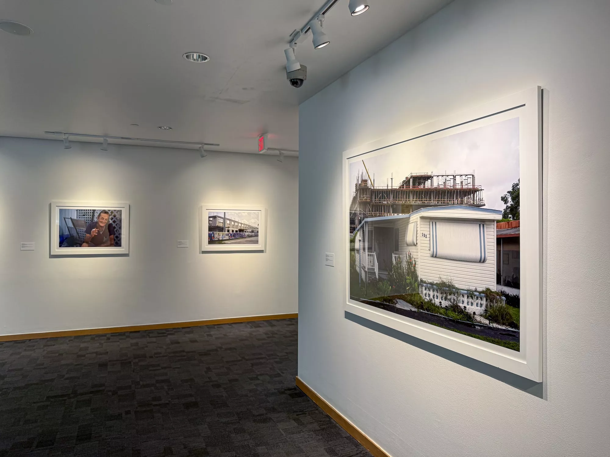

In late 2024, the residents of Sweetwater’s Li’l Abner Mobile Home Park were told the park would close to make way for an affordable housing complex. Some community members took $14,000 buyouts, but others have stayed and filed a class action lawsuit against the park’s owner, CREI Holdings, in an effort to stop the evictions. The jury’s still out on what will happen to the remaining residents of the community, but the phenomenon of underprivileged locals losing their homes to a rapidly changing Miami is becoming increasingly common.

The mobile home communities that once proliferated throughout South Florida’s urban landscape have one after another fallen victim to a slew of systematic factors working against them, from speculative real estate valuation to new housing developments and the sudden boom of transplants relocating to Miami during the COVID-19 pandemic. What was once an incentivized and convenient arrangement for landowners and new settlers in South Florida has endured a decades-long death by a thousand cuts, one which photographer Diego Alejandro Waisman has researched extensively and documents in his latest project.

Waisman’s work, on display at the Patricia and Phillip Frost Art Museum, includes large prints featured in his photobook, Sunset Colonies: A Visual Elegy to South Florida’s Mobile Home Communities (University Press of Florida), released in September 2024. The photos capture the “mobile” homes of South Florida; homes that have been locked into their respective locations for decades. It can cost anywhere from $1,000 to $14,000 to relocate even the most structurally sound mobile homes to a new location.

Waisman’s exhibition features photos of these homes and their residents, often alongside archival reporting and advertisements from publications like the Miami Herald and the Sun Sentinel. Some ads and articles promote mobile home ownership as an affordable gateway to the American Dream while actively disseminating the negative stereotypes still assigned to those communities today. Large printouts are paired with Waisman’s photos in both the exhibition and the book.

Having lived in South Florida for more than twenty years, Waisman has witnessed the city’s many changes firsthand, from rapid westward development to violent gentrification north, the 2008 housing crisis, and the COVID-19 pandemic. He is well aware of how residents have been affected by real estate booms and busts throughout Miami’s history.

“The term’ Magic City’ exists because of how quickly this city was expanding back in the 1920s, so real estate is our number one industry,” says Waisman. “I understand that it’s a business that’s feeding millions of people directly or indirectly, but at the expense of what? At the expense of who?”

“Grow” (2021), part of Sunset Colonies, highlights those tensions. In the striking image, a rising construction project looms in the background of a humble mid-century mobile home. It’s a familiar sight seen in neighborhoods from Homestead to Fort Lauderdale these days.

Other arresting images are not of the structures themselves, but of what Waisman calls “environmental portraiture”: photos of residents living their lives inside their threatened homes. Waisman’s empathy shines through here. He remembers the locations, names, and stories of everyone he photographs.

“For a long time, it really haunted me as a photographer, as an artist,” he says. “A lot of people consider photography to be exploitative…until I met another photographer who made me understand that I was, in a way, honoring these people.”

Special care shines through in “Gloria” (2022), a photo of one of the residents of a mobile home community that shared its lot with an evangelical TV station on Pembroke Road in Hollandale. The woman in the image moved to South Florida to escape the cold New York weather and spent her life savings on relocating. A year and a half later, she received notice that the trailer park was being shut down. She would need to relocate.

She could have just as easily been Vivian Hernandez, the 61-year-old Li’l Abner resident filmed in a rough police takedown at the mobile home park last year. Waisman says Gloria reminded him of another woman: his mother.

“Diego Alejandro Waisman: Sunset Colonies.” On view through Sunday, May 11, at the Patricia and Phillip Frost Art Museum, 10975 SW 17th St., Miami; 305-348-2890; frost.fiu.edu. Admission is free.