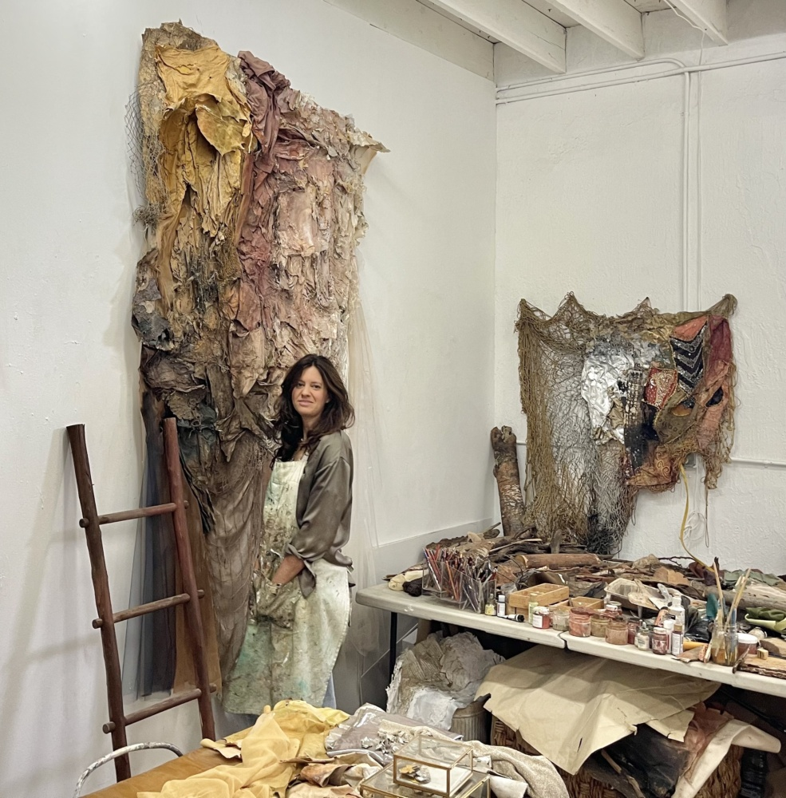
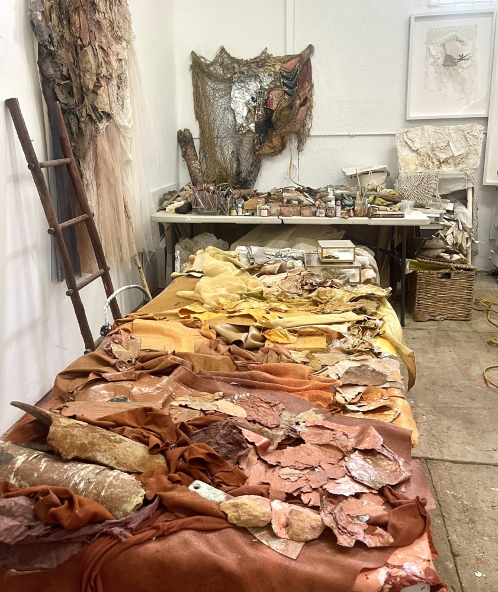

Karla Kantorovich is a mixed media, abstract artist based in Miami, Florida. She weaves found objects, natural materials, and family archives to create large scale abstract work that is rife with texture and movement. Her practice explores the themes of family history, the natural world, and self-healing. Since I have known her, she has shown her work at Piero Atchugarry Gallery, the Bass Museum of Art, and Florida International University’s Washington Street Studios. I met with Karla at her studio in Dimensions Variable to discuss her intuitive studio practice and her greater messages of reprioritizing the natural world in our lives. 

Mario Rodriguez: I thought it was important to highlight your work because it’s so different from what I see in Miami. It’s textural, earthy; other works with the same qualities often lack the depth and meaning your work has. Do you feel that you’re in a world of your own? And with that in mind, who do you look to for inspiration?

Karla Kantorovich: I definitely feel this is a world of my own. I’m trying to make sense of the world through my practice. I try to find meaning through my work. I try to understand things through materials. That’s what I feel I’m trying to do.

I feel [the work] is unique in that I myself don’t even have the answers. I really flow. My practice is very intuitive. I respond to what I find. I work a lot with found objects. I collect lots of stuff. And so in that sense, [my practice] is unpredictable to my own self, which makes it feel very alive.

MR: What struck me about your work is that the materials have a natural ephemerality to them. They look purposefully disintegrated, like if someone touched them too roughly, they’d fall apart. Can you talk about the meaning behind it? What are the things that you’re doing in your practice to try to bring permanence to the work? Is permanence even important in your work?

KK: I’m responding to something that you said before. The earthy palette has been very consistent in my work. I tend to use raw earthy materials. And yes, I’m especially interested in objects as they approach nothingness. I see a lot of beauty in the rocks in the cave. That stage of matter really interests me, because it suggests that there is something more than the physical reality we see.

MR: So are you searching for spirituality through materiality and decay?

KK: Yes, absolutely. I’m trying to find meaning, to understand more about the order behind apparent chaos and the unity behind duality. The times we’re living in are so chaotic. Everything seems unbalanced, I would say, and polarized. I’m trying to understand if there is more to these apparent relationships.

I’m trying to find connections through materials. I find connections with materials that don’t apparently seem connected. In a way, it’s like I’m challenging beliefs and trying to understand how we value things, how do we really come to a sense of understanding of the world? Through these relationships of material, I’m trying to find those answers for myself.

MR: It feels like your message in the work is simultaneously political and apolitical, because it goes beyond the concept of individual political beliefs.

KK: Yes, that’s exactly it. We’re in a crisis, a values crisis, a priorities crisis. The level of destruction went far and beyond. We need to come back. So come back to what? That’s the question. Come back to what? Come back to the understanding that we are here for a reason. There is something else behind this apparent chaos. And we need to reconnect to what we know to be true, nature.

Nature is the grounding element. We’re living here. This is our home. We cannot just completely disregard the place we live in, the wisdom that nature provides and [we should] expect for things to work out. My exhibition Amate (2022) was focused on the Amate paper from Mexico and the respect Indigenous people have for the place they live in. It’s amazing. If we can’t go back to that ancestral wisdom of understanding that without the trees, without taking care of the ocean, without taking care of the earth there is no conversation. There is no us.

MR: There’s nothing to fight over.

KK: There’s nothing. The priorities are not well-established. We’re lost in our priorities.

MR: It’s almost like that movie with Jennifer Lawrence where everyone’s fighting over politics and there’s a meteor coming to destroy us. You know what I mean?

KK: Yes, yes.

MR: And everyone’s like, we could make so much money from the meteor. But what about the meteor?

KK: We’re missing the point completely. We came so far from the roots. So we just need more of the roots. We need more of that ancestral…we need more of that rawness, more connection. We’re lacking, we’re completely disconnected from who we are and where we are.

MR: Do you hope then that your work provides that connection?

KK: I do. The work has brought clarity for me. Through the work I heal. That’s the way I’ve been able to transform and heal. I know in my personal experience that art can really heal. I’ve seen how art can open spaces for dialogue that nothing else does. It’s a safe space because it touches something beyond the intellectual. It goes beyond the limited beliefs of the mind. It touches that sacred space.

I love the word inspiration. You always relate art with inspiration. I always like to use that word very much, because inspiration, what really comes, it’s from being “in spirit”. That connection of being in spirit, in connection to something else. That it’s really not that palpable and that tangible. That space I’m very interested in. That space of connection is what I feel we need to come back to.

