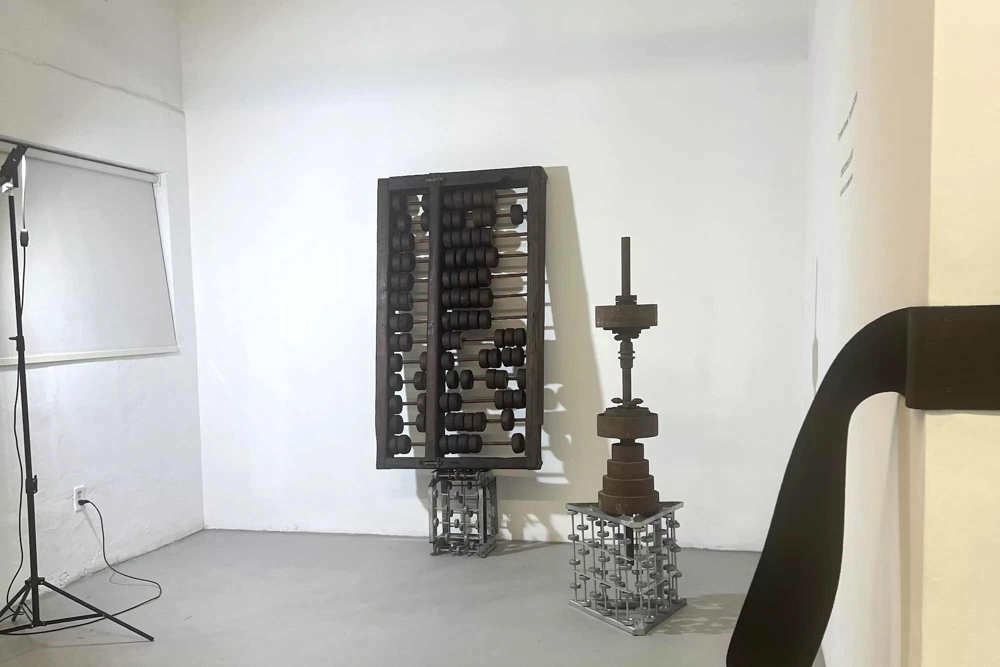
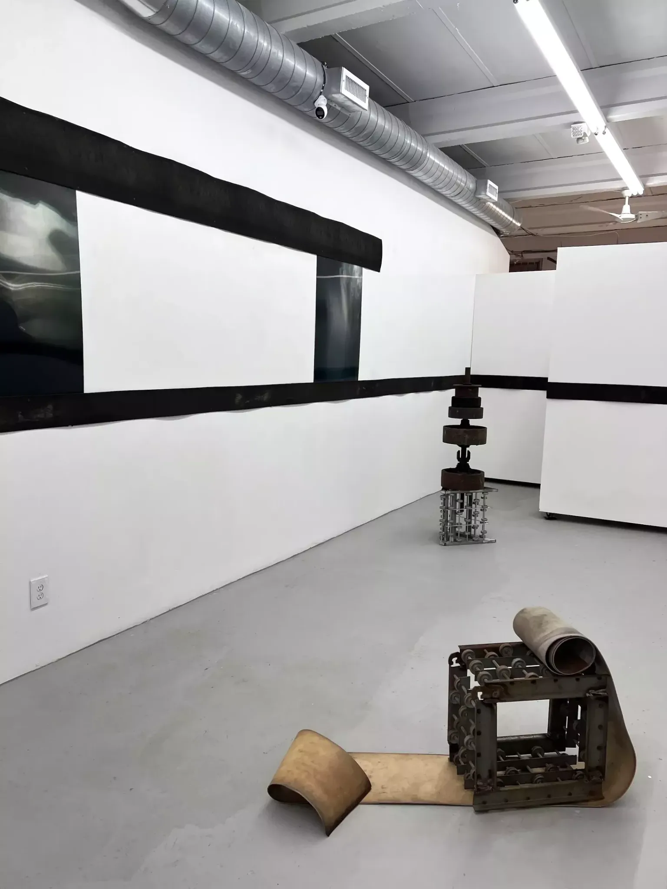

At Edge Zones in Allapattah, Christopher Carter invites viewers to check out an entirely new body of photography while also grounding themselves in the industrial, heady sculpture work with which the artist has made a name for himself over the last several decades.

Walking into the exhibition, curated by gallerist Catherine Camargo, one witnesses two distinct bodies of work woven together through the long hallway of the gallery’s main exhibition room. Carter’s distressed sculptural assemblage litters the floor, all made up of several rusted, worn-out parts of industrial machinery arranged in neat, cohesive, abstract shapes. The uniform degradation almost seems painterly and sleek, an even coat of rusted brown that melts the edges of these steel parts into one another. Each component feels like it has had a lifetime of endless, incessant labor, worked until it no longer served the purpose for which it was fabricated. They find new life in these works that are each greater than a sum of its parts, looking as if they were once alive and moving and eventually ground to a halt by the overgrowth of metallic decay.

Carter’s newest works line the walls. They are lenticular photographs consisting of several images in each piece, so many that it is nearly impossible to make out any of the individual images. At first glance, only small details, like metal staples or vague shadows, can easily be seen. Further investigations into the entirety of the holographic works, sometimes by shifting side to side in a silly dance, allow viewers to discern from the eerie green, black, and beige coloring some vague images, like the power back of a torso, or a mound of snow. As a child of the early 2000s, something about them reminds me of the McDonald’s holographs that came with a Happy Meal. As a whole, the works seem largely abstracted, and the various images create a dynamic movement that any viewer can project their imagery onto. The burly, worn, deep brown mechanical belts were a curatorial decision to add to the effect of the entire installation, although they are not works themselves. In a serendipitous turn of events, Camargo happened upon them on the side of the road shortly before the opening, a lucky break since Carter had been collecting these belts for quite some time and was never able to find enough belts to install them in an exhibition in this manner.

An anchor to the exhibition stands directly to the right of the entrance, and it was the work that first prompted me to come to see it after the curator posted images of it on social media. Abacus (2003-2009) is a large-scale abacus made from the reclaimed wood and steel of a foreclosed home in Silicon Valley, which Carter states on his website “fell victim to the Enron ‘futures’ debacle.” The large, ancient mathematical device is ironic in a symbolic and literal sense. Ultimately, much of the Enron scheme was just fancy, phony math, much like many of the tragedies and crimes of the modern world. Fancy, phony math made possible the housing market crash of the early 2000s, the neoliberal policies that left much of Central and South America poor and in crushing debt, and even the current inflation where it seems like everything is double, triple the price it was three or four years ago. If you focus on what Abacus sits on or several of the other silver stands that prop up the sculptures throughout the exhibition, you’ll notice they are also all metal abacuses.

Overall, “Tethered Visions, Released Codes” is a worthwhile exhibition if for no reason other than to expose yourself to a style and aesthetic of contemporary art that is grittier, sleeker, and more unconventional than what is typically exhibited locally. Miami art spaces often feel the pressure of conforming to our collector base’s tastes and prioritizing art that will sell. Meanwhile, the work Edge Zones supports feels more grounded in research, expression, and freedom from the pressure to break even at closing. It’s important to note that part of its ability to do this is thanks to the public funding they receive, funding slashed by the latest budgetary cuts under Gov. Ron DeSantis.

Institutions that are supported with at least some sort of state funding are important for this very reason; they don’t always have to answer to a board of directors or collectors, and as a result, we, as the viewers, win by seeing great shows from artists and curators who are getting a unique opportunity to simply do what they love. “Tethered Visions, Released Codes” is an excellent example of all we stand to gain by protecting these sorts of opportunities for the arts.

Christopher Carter’s “Tethered Visions, Released Codes.” On view through Tuesday, November 12, at Edge Zones, 3317 NW Seventh Ave. Cir., Miami; edgezones.org.