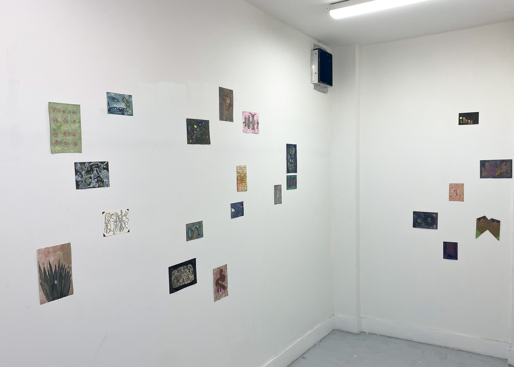
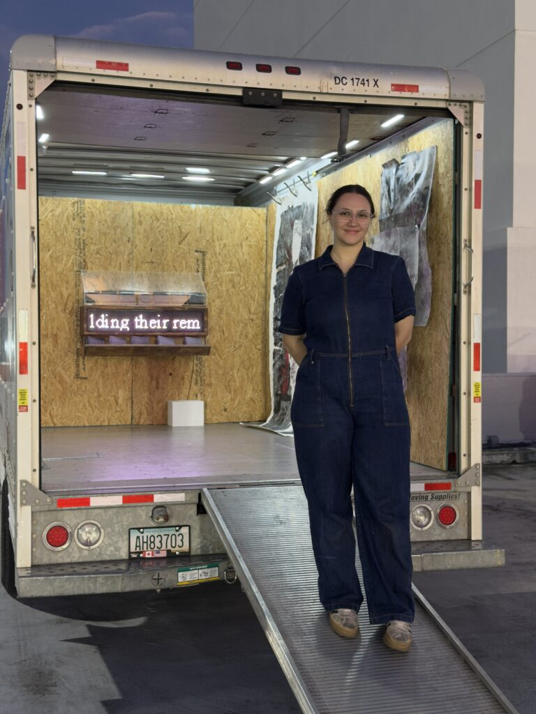
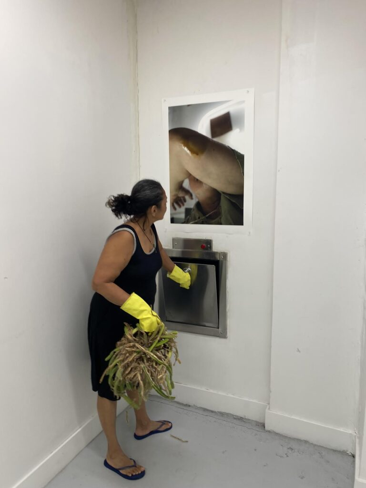
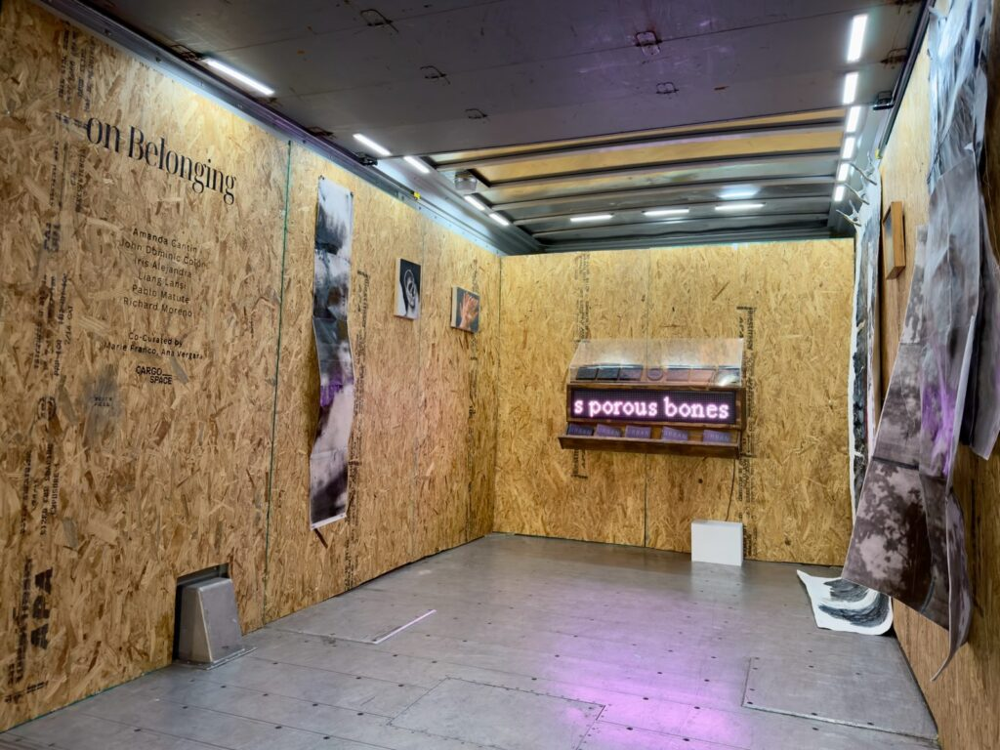
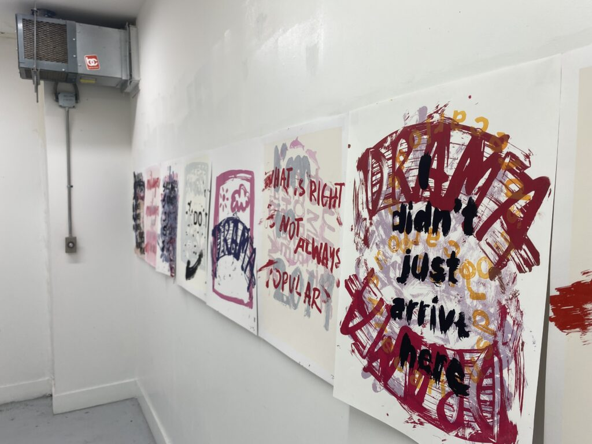

Exhibitions are a core function of any professional visual artist’s work; they are the primary medium by which art lives in a public space and connects to the world. Highbrow, conventional exhibitions in today’s landscape feed into a kind of art world machine. For those at the top of the food chain, work goes to galleries, where it must be sellable for the gallery to survive. It is then sold to collectors, who in turn feed into the museums where they serve on boards of, or into private (but public-facing) collections.

This entire process requires access, connections, and, most importantly, money. But what happens to those who live outside that inner circle? And what happens when you factor in rising rents, limited real estate, and the fact that local organizations making exhibitions outside this system—such as Tunnel Studios, Laundromat, Edge Zones, and Rice Hotels—can only accommodate a certain number of artists each year?

Now more than ever, members of the local art community have developed a strong undercurrent of conceptually forward-thinking and varied artists—more than the current ecosystem of exhibition spaces can accommodate. As in other decades and parts of the world, this climate has prompted artists to think outside the white cube, expanding where and how exhibitions can take place.

Trashroom Gallery and Cargo Art Space are two examples of this reimagining of space. Both further democratize exhibition participation while breaking with conventions of what is necessary to put art into the world.

Trashroom Gallery was started by local conceptual assemblagist Alfredo Travieso in 2025, when he realized the trash chute room in his building had enough space to accommodate a small exhibition of his own work. Travieso describes it as a “clandestine project,” not only because neither his landlords nor the building are aware the space has been turned into a gallery, but also because its location is hidden from the public.

With a few exceptions, most artists drop off their work and Travieso installs the shows himself. Only his neighbors see these exhibitions in person; they live publicly through Instagram.

“I usually don’t let the artists into the space. They drop off the works, I put up the show, I document, and then I give them the works. There’s a practice of community… a kind of relational aesthetic. It’s become a very symbiotic relationship with the artist.”

In creating Trashroom, Travieso works through layers of irony and opposition. The project plays with elevation and debasement at once. It gives new life to artworks by exhibiting them, yet that life takes place in the same location where people discard their garbage.

Trashroom also flips several tenets of traditional exhibition-making. There is no budget, no sales incentive (to date, only one piece has sold, with proceeds going to the artist), and no opening receptions or programming. Some may argue these are not “real” exhibitions. Yet in their focus on simply giving artists space to bring work into a public sphere, they do so in a purer, more idealistic way than the traditional white cube.

Cargo Art Space, founded by Ana Vergara through Florida International University’s Ratcliffe Art + Design Incubator, takes a different approach. It hosts exhibitions inside a cargo van—typically a U-Haul—retrofitted with walls and lighting for installations.

The idea itself is not entirely new. Cargo cites inspiration from the Miami-Dade Public Library’s Artmobile program from the 1970s to the 1990s, and it recalls more recent projects like the U-Haul Gallery. But novelty is not the goal—access, community, and mobility are.

“It’s so expensive to rent a conventional space, and a U-Haul is $29.95 a day flat rate. That price becomes unbeatable if you want to put on exhibitions wherever and whenever you want,” Vergara explains.

Cargo exhibitions exist in a similarly ephemeral way to Trashroom. Sometimes all within the same day, Vergara rents the van, installs the walls and lighting, hangs the show, exhibits it, and takes it down. Viewers find the location online and attend what is effectively both the opening and closing. After that, the exhibition lives on primarily through documentation.

For both Trashroom and Cargo, social media and online platforms act as critical repositories for visibility and permanence. While all exhibitions rely on online sharing, here these platforms function as a primary viewing space rather than just promotion.

This shift raises questions. Are exhibitions meant to be experienced in person, or online? And if part of the intrigue of these spaces is their transience and opacity, is that diminished by digital visibility?

Part of the answer may lie in who shows up. Vergara recalls an older woman from a nearby church and a local business owner stopping by—people she would not typically encounter in a conventional art space.

“That’s the beauty of Cargo,” she says. “There’s no hierarchy. I treat everyone equally.”

WHAT: Trashroom Gallery
WHERE: Location not disclosed
COST: Free
INFORMATION: @trashroom_gallery on Instagram, or contact Alfredo Travieso at televisor@gmail.com

WHAT: Cargo Space
WHERE: Space is  announced within a month of opening, flexible based on location of van.
WHEN: Last exhibition was 4:30 p.m. Saturday, March 14, next opening will be announced online.
COST: Free
INFORMATION: www.cargo-space.net or @cargo__space on Instagram

ArtburstMiami.com is a nonprofit media source for the arts featuring fresh and original stories by writers dedicated to theater, dance, visual arts, film, music and more. Don’t miss a story at www.artburstmiami.com