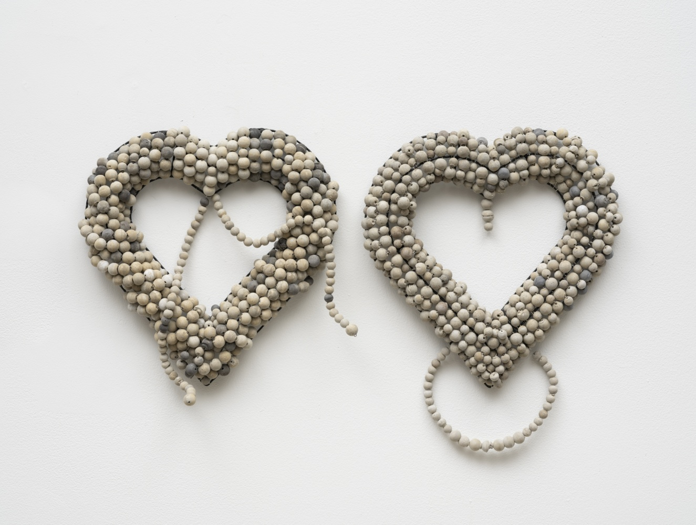
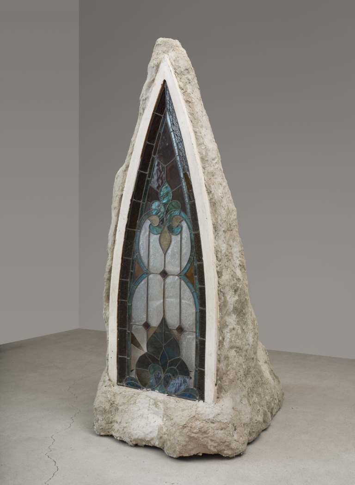
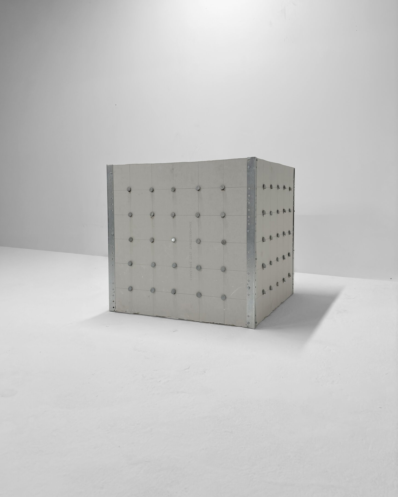
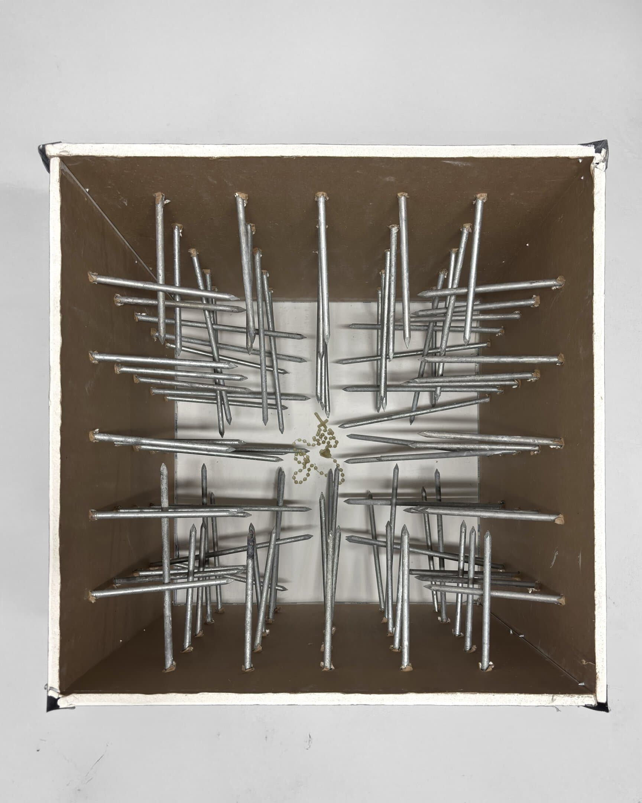

Miami-based artist Luna Palazzolo-Daboul’s work counters easy answers, expediency, and productivity. Any single work is expansive. The Argentine-born artist explores raw, synthetic, construction materials that reference Goya, create a self-portrait, and elicit a statement about labor. Each piece is what it seems to be, while giving several layers of philosophical quandaries beyond what is visible.

Palazzolo-Daboul, like many other self-taught artists, found their way to notoriety without a playbook. Instead, their obsessive dedication to craft guided them. Palazzolo-Daboul chooses materials and processes that are resistant to ease. Making the work is repetitive, physically exacting, and mundane at times. She describes her process as a durational performance: “I’m interested in what happens when an idea has to pass through the body before it can become an object. Making hundreds of nearly identical pieces, carrying them, stacking them, and rearranging them produces its own knowledge. Fatigue, failure, and repetition begin to shape the work in ways that cannot be strategized. The evolving process leaves evidence, even when the finished object appears controlled or minimal”.[1] The resulting work uses abrasive industrialist supplies, like concrete, epoxy, or metal in order to communicate tender thoughts and embody a palpable spirituality.

Of possession (2025), recently acquired by the Perez Art Museum Miami, is a diptych of two wall-hanging, non-anatomical hearts made of metal wire and concrete beads. Modular marble-sized beads function as the building blocks in several of Palazzolo-Daboul’s works, where she finds ways to “build” with concrete obtusely, by threading these dry concrete beads delicately along the metal wires rather than simply pouring wet concrete into the shape of the desired outcome. This roundabout method is intentionally arduous, as Palazzolo-Daboul states “I probably do make things harder for myself. But I think I need the labor to transform me a little, too. If the work asks questions about sacrifice, endurance, belief, and reward, then its making cannot be entirely comfortable.”

Often austere in color and texture, Palazzolo-Daboul’s works can still carry an ornate decadence from traditional Roman Catholic imagery. In O la temporada que Rimbaud pasó en el infierno (2025) Palazzolo-Daboul holds two visual elements in tension. From behind, the work looks like the remnants of a demolished building, a familiar motif to pull from in Miami where historical sites and office buildings alike are constantly built and torn down. However, the front of the sculpture is an arrowhead shaped with a rounded stained-glass pane, referencing traditional Roman Catholic churches. The title is an homage to A Season in Hell (1873), an angsty, dark nineteenth century narrative poem by Arthur Rimbaud, in which the protagonist’s descent into hell is a proxy for his personal descent into madness.

On the visual connection between her work and religion, Palazzolo-Daboul states, “I don’t think my work has that much to do with religion itself. I’m interested in Catholicism less as a belief system than as a structure through which I can speak about labor, doctrine, effort, punishment, forgiveness, gender roles, conditioning, death, and the promise of an afterlife.” In Intra-mural (2025), a piece shared on the artist’s Instagram and currently only on view from her studio, Palazzolo-Daboul constructs a cube out of drywall squares attached to one another with bent sheet metal. The top face is missing, leaving the center of the cube visible. Galvanized spikes, recalling the crucifixion, are nailed into the center of the cube symmetrically and equidistant. At the very bottom of the treacherous interior lies her grandfather’s rosary. Is the box meant to keep someone away from the rosary or to trap the rosary inside?

It is transgressive in Miami to see an artist create something sacred from discarded construction supplies. Palazzolo-Daboul notes, “Miami is an extremely clashing place, conceptually. It is as if the city hides little presents for me and gives them to me in installments, and I treasure them forever. It is beautiful and sad and all the things portrayed in the movies, but it is also so, so deep. You can only really know that if you’re in on the secret, and the secret reveals itself slowly, after you’ve been here for a while.” The city is rife with oxymoron and as a lover of oxymorons, she fits right in.

[1] Interview with the author, July 17, 2026.