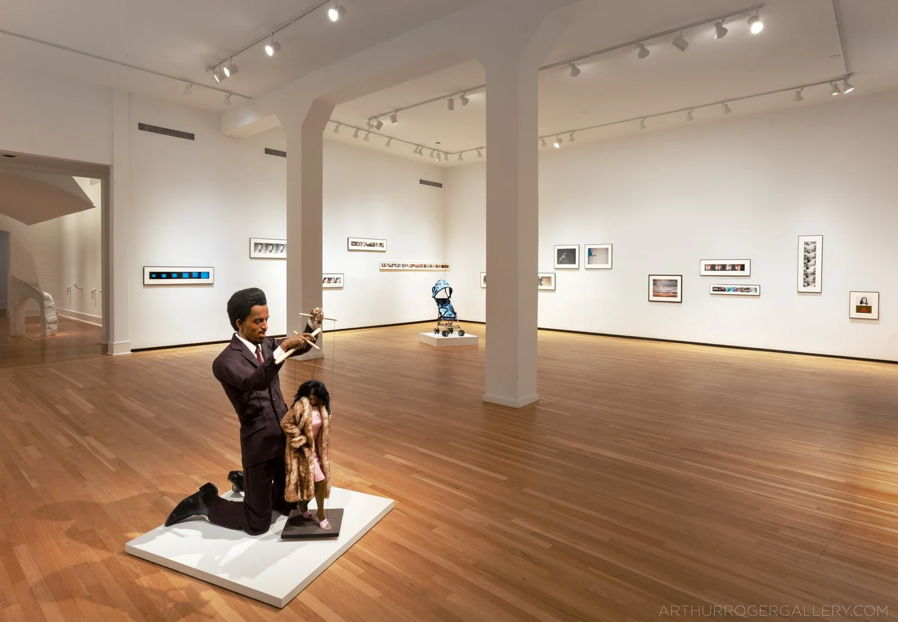
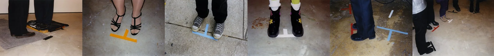

The _Worst of Waters_ is a solo exhibition of John Waters’ photography over the last thirty years, on view until November 15th at Arthur Roger Gallery. The show’s premise, reflected in the title, memorializes the work that was the least successful or popular, and the least sold, in what has undoubtedly been a successful career. According to the gallery, the project  also serves as a farewell to the artist’s photography practice —a swan song, a Hail Mary to showcase the last few scraps before packing it all up and saying goodbye. 

Several of the photographs are an extended rectangular series of images collated in one long row, occasionally repeating the same image or vacillating between different scenes from movies or television. The works hang along the front room of the gallery, in layers over one another along a make-shift horizon that runs across all of the walls.

The exhibition feels quintessentially American in its references to pop culture, overt sexuality, and violence. Waters captures the spirit of MGM’s and Eve Babitz’s Hollywood, one wherein violence and lust (and a lust for violence) wait at every corner, when movie stars were worshipped like gods and many would do anything to be one. Pyro (2003) hangs on the left-hand side of the gallery, showing alternating images between scenes of fire and the face of a man perhaps in the throes of sex. The closer to climax he seems to arrive, the more ecstatic and vivid the scenes of incineration become. 

The opposite side of the room features Hit Your Mark (1998) wherein Waters includes photos of spike marks on the floor of movie sets, alongside the actors’ feet. Necro (2009) features images from several actors playing dead in coffins from movies including The Funeral (1996), Mommie Dearest (1981), Secret Ceremony (1968), My Girl (1991), and Belle De Jour (1967). Throughout this and other works, Waters pens his love for the morbid grotesquerie of show business, the underbelly that preserves it. If the show had a scent, it would be of sweet, hot garbage.

Idol #2 (2009) and Idol #3 (2014) hang one over another and both feature several images of singers Johnny Mathis and Mrs. Miller, respectively. The snippets of Johnny Mathis come from a scene in the film Lizzie (1957) for which he plays a bar performer singing at the piano. The film's heroine is plagued by a dramatized representation of dissociative identity disorder, where some sort of maneater Mr. Hyde persona that calls herself Lizzie takes over in the night. The only other people who receive the same level of focus in this exhibition through a portrait photo series are Jesus on the cross (15th Station, 1996) and Gertrude Baniszewski (True Crime 1, 1996), a woman from Indiana who was tried for the murder of Sylvia Likens. Likens was a young girl left in Baniszewski’s care by her parents and who shortly thereafter died from the severe abuse and neglect wrought by Baniszewski and her family. The challenging question to explore in this selection of portraits is whether the works are meant to carry a message as a unit or not. Do these images all tie together in their representation of entertainment meets perversion, some of which is sexual and much of which is downright violent? Or is it really just that collectors didn't want pictures of a brief 1960’s housewife starlet and a random psychopath from the Midwest hanging in their homes, leaving the works to eventually be shown together here? 

If nothing else, the show is a thoughtful representation of Waters’ idiosyncratic perspective, mixing film history with Americana and cultural critique. The project’s premise is outwardly amusing in its honesty; this is not the first or the last time an exhibition of a great artist’s “leftovers” will be put together to spark new interest, be it in a gallery, museum, or art fair. What is certain is that if this exhibition really features The Worst of Waters, then he has indeed left his career for want of any truly bad art.  

See The Worst of Waters at Arthur Roger Gallery through November 15, 2025. 432 Julia St, New Orleans, LA 70130.