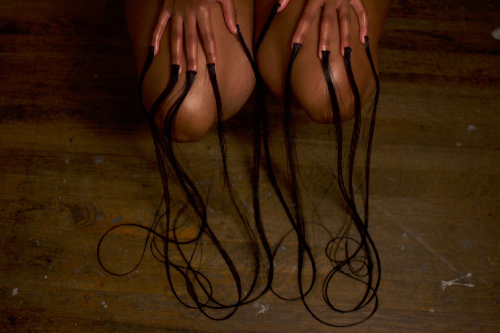
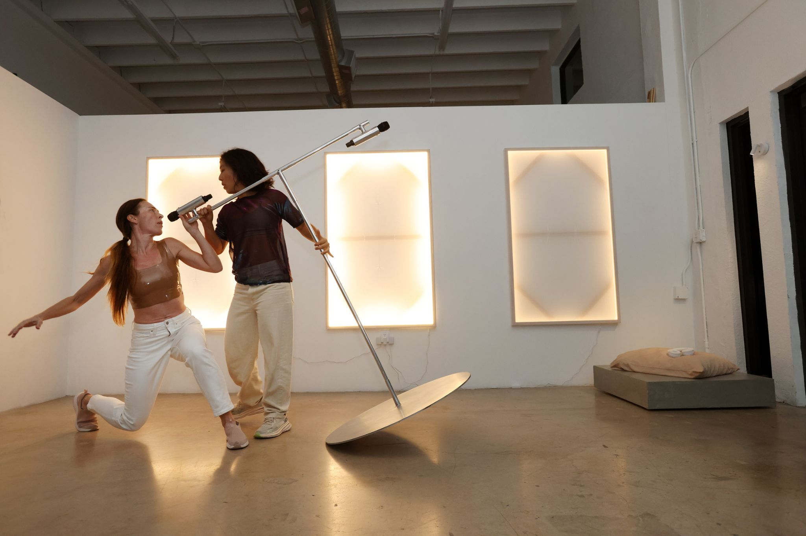
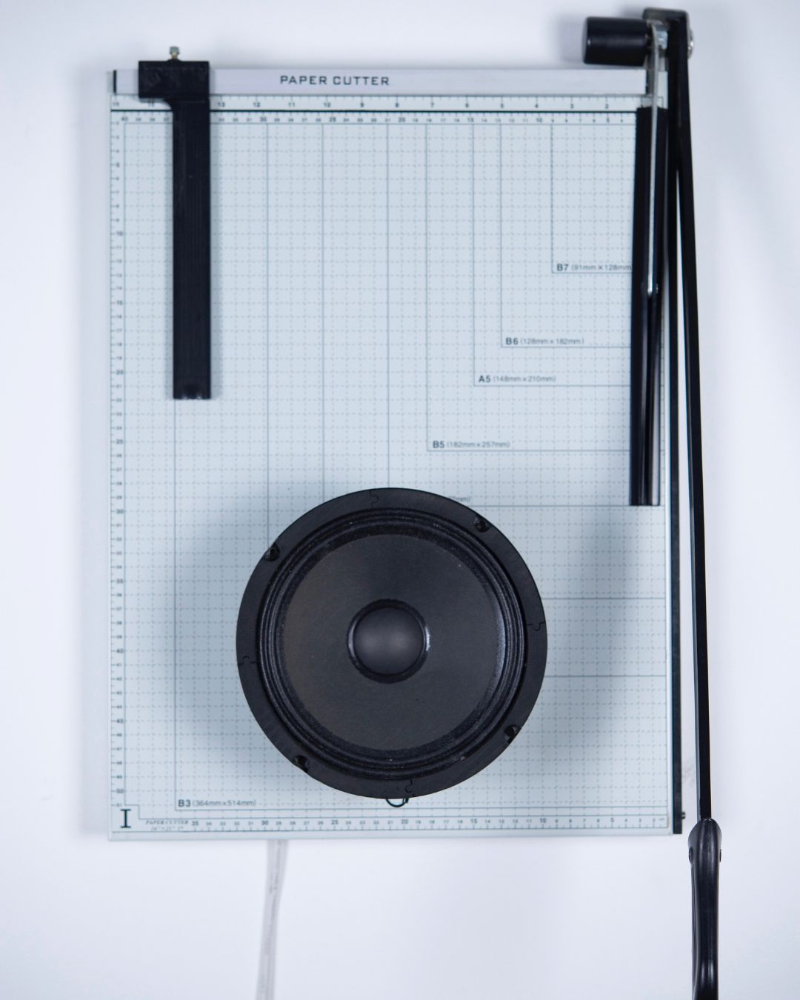
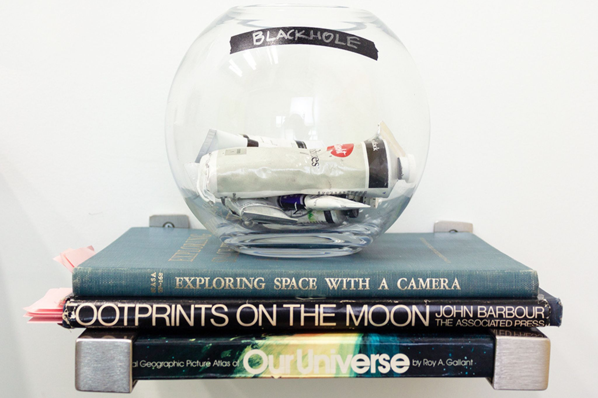
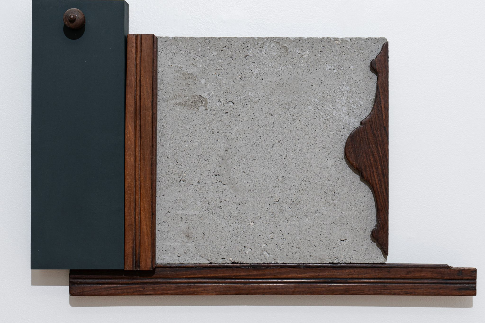
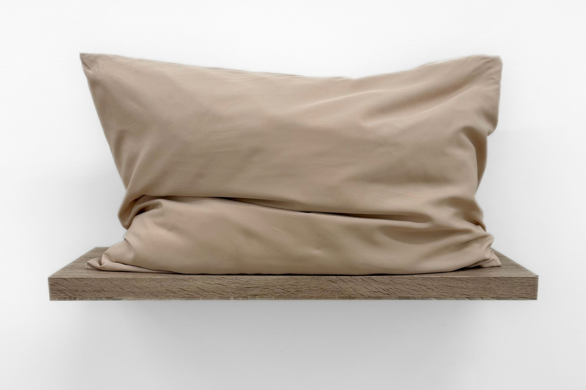

When viewers first walk into the first room of Immaterial, the latest group exhibition at Collective 62 curated by Melissa Wallen, they may feel challenged to draw the line between each respective artist's works; in fact, the works are so seamlessly aligned with one another, they almost seem like different series by the same conceptual artist. Sound heightens this effect. Richard Garet’s Cut (2024) a wall-hanging assemblage sculpture made out of a speaker hooked onto a cutting board- repeatedly hums a simple beat. It plays in rhythm to the recording of Roxana Barba’s performance work, In my center, a cyborg seed (2024)*,  all of which orchestrates with the flickering light of one of the Striae (2024), by Stephanie Hadad. Hadad’s three rectangular wooden frames hang with gauze stretched over them, translucent enough to make out the lighting that lines their inferiors. The gauze is carefully, subtly threaded along vertical and horizontal lines to make minimalistic geometric abstractions, representing the changes a female body experiences through childbirth. In all, the works in this room cooperate in a funky, surreal symphony, one which happened out of sheer luck, since the leftmost Striae (2024) was not initially meant to flicker the way it does and the two sonic pieces were not designed to duet with each other.

Immediately to the left of the front room, Barba’s three De Huacas y Huaqueros (Ladrillos) (2024) are cinder blocks hung directly on the long hallway in which the remainder of the show spills. In the top opening of each cinder block, viewers can find oranges and blue-tinted images of hands holding a clay pot. These earthy, sentimental images reference Peruvian pottery but are completely reimagined within avant-garde framing. They face some of the works of the Perceptual series (2015) by Garet. Three shining, technicolor, abstract images shine from TV displays. To create them Gater used algorithmic processes to illustrate different sounds through color. These works, while begotten from sound, do not make any noise themselves; they are visual representations of sound, a still life of a thing that has no materiality, image, or shape of its own yet many of us can easily identify and which our language describes with material adjectives (heavy base, rough noise, smooth jazz).

Garet is not the only artist in Immaterial who grapples with new technology. Farther into the hallway, three electronic displays of Cynthia Cruz's works are hung like a 21st-century perversion of a church triptych. For My Bitches, Part I (2014) plays a glitchy black-and-white recording interloping Cruz's frantic panting with that of a dog. The title has a fun, irreverent tone that gives the work some humor. However, Cruz's recording is something more disturbing than an excitable dog’s panting. It sounds crazed, unhinged, and worked up into a frenzy. On the right side, another display plays For My Bitches, Part II (2025), where the video has been redone by AI. Notice the color, tone, how it's suddenly easier to make out images, the way it is ruined (and I mean ruined in a good way) by the glossy varnish over it that is so quintessentially AI. In the middle, Do You Want to Be Human? (2020) displays poetic answers by an AI to the question posed in the title. You can contemplate many things in this part of the show, like the AI responses:  “What is it that makes you human?…Do you see yourself as a complex biological machine…Or do you see yourself as a conscious entity?”. I think of what it means for something to be consciously intelligent in the first place, of the surreal things machines achieve as technology advances. In a world where tokenized AI images of skater boy apes are traded for more money than many artists will make in a lifetime, where every other artist grant is allocated to “art meets tech”, it is hard not to lean into being a Luddite. Works like Garet’s and Cruz’s, however, show that not all hope is lost in the world of artful tech, that tech as medium AND subject matter can still be inventive, profound, meaningful, and not make you want to roll your eyes. 

The last few artists deal with (im)materiality in a much more physical sense. Amanda Linares and Brooke Frank each feature works that are catch-22s; the meaning of the work begets their imagery just as the imagery begets the meaning back. Frank’s Friends with BLACKHOLE (2024 - 2025) features a stack of copies of Theodor Adorno’s Aesthetic Theory, each of which is a different color; they are not different editions of the same book, but the same book with prolonged exposure to different lights. The books are coupled by an unopened container of Schmaltz black paint in a display case, a painting of a lunar eclipse, and a still life of the sun-bleached books themselves with the lunar eclipse painting in the background. The original lunar eclipse painting hangs just beside its portrait, each of which is painted using Schmaltz black paint. The layers in which each of these works relate to one another are enough to cause a headache. In their totality, they cleverly express the conundrum between the academic theory of color and the reality of color we all see, in a visual language that reads like a riddle. 

Amanda Linares’s work that most explicitly blurs the line between reality of perception is Sismo 7.5 (2024), where the cracks in the concrete around neatly arranged clay tiles are complemented by fake cracks, impossible to discern from one another from afar. This effect is even more confusing when you see that the cracks in Scar (2023) and Skins II (2023) are all entirely real. Linares takes trompe l'oeil to a new level, making something as day-to-day as a crack in concrete feel intentional and elusive at once.

At the end of the left side of this long hallway, two of O’Neale’s poly silk photographs flow in the breeze of the studio's air conditioning vents, giving them a rhythmic movement vaguely in tune with the sound effects at the very beginning of the exhibition. In each photo, a young black woman displays long flowing hair attached to her fingernails. These hair extensions, a nod to the several bold and intricate hairstyles borne out of black communities, are turned on their head by being applied on a different part of the subject's body. 

Immaterial is an aptly titled group exhibition that features work by Roxana Barba, Cynthia Cruz, Brooke Frank, Richard Garet, Stephanie Hadad, Amanda Linares, and Alexandra Fields O’Neale, artists that push their work beyond the explicitly visible, or tangible for that matter. Although this exhibition explores several different mediums and methods, it coalesces around one simple commonality: that the medium itself is in part the subject matter, and not simply what is used to express an idea.

SAVE THE DATE:

What: Immaterial, at The Collective 62
When: January 31- March 22, 2025
Time: by appointment unless an event is taking place
Where: 827 nw 62 Liberty City, Fl 33150
More Info: https://thecollective62.com/

What: AI Drawing Workshop with Cynthia Cruz
When: March 15, 2025
Time: from 7:30 - 9:30 PM
Where: 827 nw 62 Liberty City, Fl 33150
More Info: https://thecollective62.com/

*Video made in collaboration with Antonia Hinestroza (TouchDesigner animation) and Carlos Dominguez (sound)