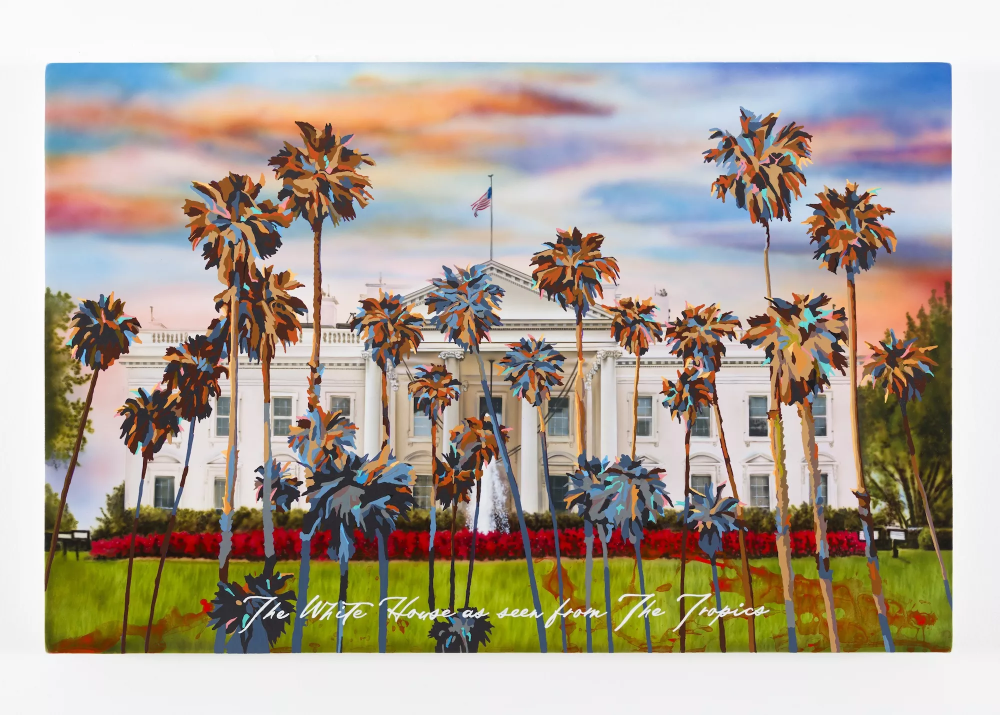
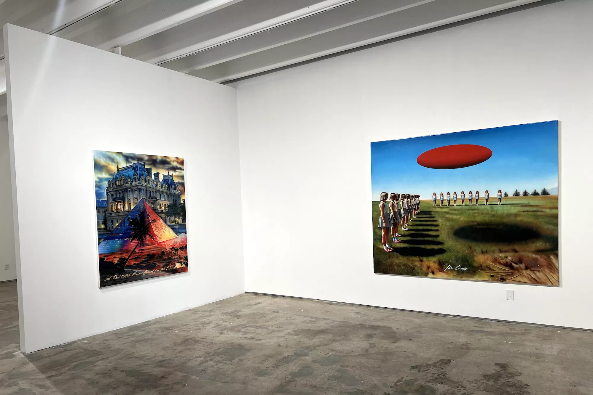

Walking into “Talking to Computers,” a solo exhibition of conceptualist Raul Cordero’s work at Fredric Snitzer Gallery, it felt immediately apparent that I was experiencing work from the perspective of someone from a different generation than my own. I did not infer this because I had already researched the artist – admittedly, I saved that for after seeing the exhibition – or because the work felt dated in any way. On the contrary, the subjects of information availability in the digital age, or the excess of technological engagement to perform any and all tasks in our day-to-day lives, felt very current.

What gave Cordero’s perspective away was a quick aside at the very start of his statement on one of the main walls of the gallery. “Not so long ago, a Latino artist-or LATINX, to go with the times…” felt like a quintessential way an artist in his 50s may express a desire to be “hip to the times” while also not being completely at ease with them. Even this quick quip illustrates one of the core themes in this show: life post the tech boom. The world has changed so drastically since computers, cell phones, and the internet completely revolutionized it, and yet most people under the age of 30 (myself included) likely cannot recall a time before these things became a part of our everyday lives. Cordero somewhat ironically created this body of work through a combination of artificial intelligence and hand painting to describe the unanimous and unequivocal presence of the internet everywhere, with a hint of the cognitive dissonance anyone could expect to have after experiencing a full adult life before these tools even existed.

Despite their glossy, shimmery, flat finish, many of the paintings in this exhibition are quite layered. Cordero first creates images often featuring global monuments, like the Alps (The Tropics), an Egyptian pyramid (A Real Estate Vision Board for the Internet User), or the White House. Something about these images does not feel quite right. They are artificial, too realistic to be real, and they have a glossy veneer typical of the very AI software we have come to recognize on social media platforms and internet apps. In a way, it almost doesn’t matter if the images themselves are real photographs. They represent a whole universe where so much is readily available at your fingertips, where the wealth of information access accompanies the complicated task of discerning truth. Anyone can easily see the Alps via search engines like Google Images, but many of the images they’d find could easily be of a completely different mountain range or doctored in Photoshop, and the viewer would be none the wiser.

Cordero paints tropical plants over several of these images but in a color-blocked style that can only be described as reminiscent of the saturated, kitschy photo filters popularized on MacBook photo booths and the Facebook pages of middle school kids between the 2000s and 2010s. (I, incidentally, was one of those kids.) On the bottom of many pieces are short statements meant to communicate the concept behind each painting. In The White House as seen from the Tropics, a timely work in an election year, there are enough color-blocked paintings of palm trees to obscure the image of the White House. In a conversation with Cordero, he notes that tropical fauna is a running motif in his work to represent the concepts of center (i.e., Europe and North America) and the periphery (i.e., Latin America and the Caribbean), the follies of colonialism, and his identity. This painting feels like a reminder that while people may now engage virtually with the hub of global politics in places like Latin America or the Caribbean, they still do so from the outskirts.

Another throughline in this exhibition lies in these bizarre, somewhat surrealistic images of young women lined up in several arrangements on large grassy expanses, all while donning uniforms with pleated skirts, red sneakers, and blunt bobs. In one such painting, The Drop, a red elliptical orb hovers above the young women like a hypnotic, menacing spaceship. The girls are all seemingly in a trance, not unlike the trances we are all in all day, every day, on our devices while we do quite literally everything. (The other day, I saw someone drive through a median head-on because they were honed in on their smartphone.) This and other such pieces are illustrations of the things that Cordero himself doesn’t quite understand about internet culture, like waiting for the drop of a collection of clothing you haven’t even seen before to buy it or performing silly challenges on camera to garner attention from others (The Challenge). The work feels creepy, yet it calls the viewer’s attention to something that is now so insipidly commonplace. I am living a large part of my finite life online while wholly disconnecting from the physical, real world around me.

Cordero argues that in “Talking to Computers,” he is merely trying to represent modern society, similar to how classical masters illustrated the clothing, customs, and ways of life in the paintings he studied in university so that in 100, 200 years, people can understand what it was like to live in today’s world.

He hopes to exaggerate what is happening the way a figurative painter may exaggerate color, shadows, or depth to get a more accurate impression of the real deal. He approaches the digital age at once as an outsider and a wholehearted participant, poking fun at us for being so glued to our devices while fully employing them in his artistic practice. All irony and critique, I leave this exhibition feeling all the more conscientious about my shameful, eight-hours-a-day screen time.

Raul Cordero’s “Talking to Computers.” On view through Friday, October 18, at Fredric Snitzer Gallery, 1540 NE Miami Ct., Miami; 305-448-8976; snitzer.com. Tuesday through Saturday 11 a.m. to 5 p.m.