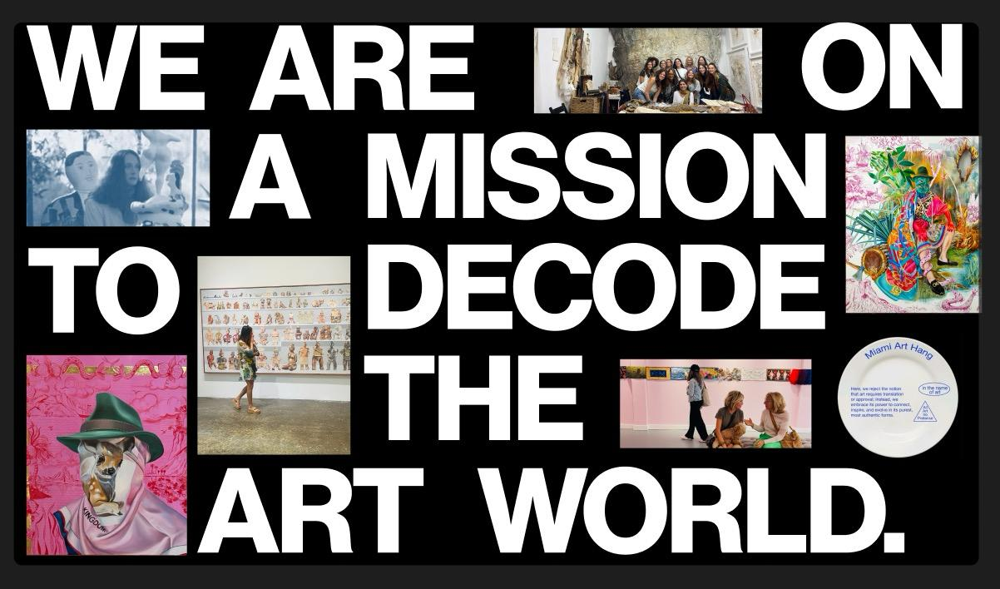
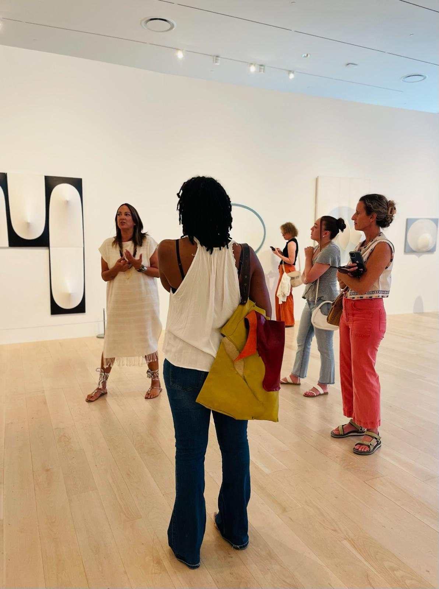
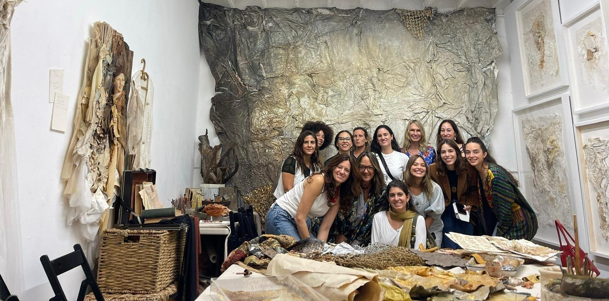

MIA Art Hang is a curated exhibition tour program run entirely by Veronica Pesantes, a local curator, arts writer, teacher, and cultural organizer. Pesantes hopes to bring criticality to the forefront of her MIA Art Hangs, allowing viewers to get the “insider’s scoop” on the exhibitions she takes them to, and to appreciate what they’re seeing through cultural and theoretical context.

“About a year and a half ago, a friend from The Met sent me clients from New York… British clients, in town for Art Basel. They didn’t have anyone to show them the local scene, even though they had a mansion on the Venetian Causeway.” After showing these newly referred collectors local haunts like Espacio 23 or Nina Surel's studio, Pesantes realized that she had tapped into something noteworthy.

What is the Miami art community truly missing? To people like Pesantes, it is connoisseurship. Critical connoisseurship. “Since I moved to Miami from New York I was like… where's the art criticism? There's a lack of critical analysis in Miami. There's a lot of art, Art Basel, all these galleries, but not enough critical inquiry.”

And her assessment is correct. We have the talent in spades. We have the programming and institutions putting on monthly exhibitions, as aptly proven by organizers like Dainy Tapia of ArtSeen365. Still, we lack a public that makes it a habit to come to openings and bear witness to the exhibitions outside of an opening. Often, museum, gallery, and third-space openings are filled with the same 50 or so people who attend everything. While all members of the art community are grateful for these entrenched, informed, and supportive attendees, it is time we make our debut for people who aren't just “art people.”

So what is stopping the non-"art people”? And what is MIA Art Hang doing to try to bring them into the fold? The truth is that fine art can be unapproachable, vague, and frankly, scary for people who are not fully engrossed in everything that's going on. This unapproachability is not helped by some of the cold behavior newcomers confront in certain high-end gallery spaces and contemporary art museums. Beyond that, unless one knows where to look, it can be quite difficult to know where to go and when. Pesantes’s solution is simple: she figures it out for them. As she puts it: “I come from New York, where (looking at art) is an activity. That's what you do on a Saturday, you go to Chelsea and you gallery hop. And we are totally missing that here, and there's a market for it, but people don't have time to figure it out for themselves, so I thought, ‘how can I make that happen?’ How can I offer this as an experience where I do all the legwork?”

Pesantes teaches through MIA Art Hang, but not in a formal, highbrow, intellectual fashion. As she takes you through exhibitions hosted around Miami, you might hear her let out a “this is just fucking incredible” or a “you NEED to take a look at this, it’s so cool!” She is authentic, doesn't take herself too seriously, and she speaks in a colloquial language that people can digest without being intimidated. What's more, she is excited, and she knows what she’s talking about.

"The way I set myself apart is that I really get in—I really do my research on the artists, I really ask the questions that I would ask a critic, a historian, and I think that's the piece that people like." She bounces from installation to installation, explaining art's historical significance, sociological topics, and maybe even a funny anecdote she heard from the artists themselves. Pesantes’s excitement commands attention in a way that several monotone, more contemplative tours fail to do. Her spontaneity makes you want to follow along, like you're just visiting the museum with a friend you might get lunch with. Or see another show with. Or not. Or wait, who's driving the two of you to the next place anyway? I don't know, maybe we should carpool. Wait, do you want to check out this other gallery on the way? Next thing you know, you're three hours deep, in the middle of a studio visit that wasn't even on the original Art Hang agenda. This is what being an art connoisseur is really about, and it's a fun journey that Pesantes fully curates for you right under your nose, sometimes on the fly.

MIA Art Hangers may not realize when touring that, as non-establishment as she carries herself, Pesantes’s background is very establishment. She's just pretty chill about it. Pesantes holds an MFA in Art History from the University of Chicago and worked in Museum Education for the Guggenheim in New York City. She's a curator, writer, art advisor, and the head curator for the first Quito Design Week in her native Ecuador. In short, she is fully entrenched in the contemporary art world and a very well-studied, qualified voice to be offering education services to the public—and a unique one to which people on tours don't often have access.

When asked about the future, Pesantes has a lot of ideas and separate paths for which MIA Art Hang could go in the long run. An online platform for people to learn art and art history basics, an affordable membership model, or a Gertrude Stein–style salon, where people can come for intimate artist talks and get-togethers, were all examples of things people could look forward to. That said, there is still a long way to go. “I mean I am working on the website, but it's just me is the thing.”

So, how do people participate in MIA Art Hang? For now, you can follow @miaarthang, where Pesantes posts about the date and schedule of each Hang. You can also email info@miaarthang.com to sign up for her newsletter. For those interested in traveling with MIA Art Hang, one of the next big projects Pesantes is working on is a group trip to Cuenca, Ecuador, for the Bienal de Cuenca, the second oldest of its kind in Latin America!

Connect with MIA Art Hang
Instagram | Web