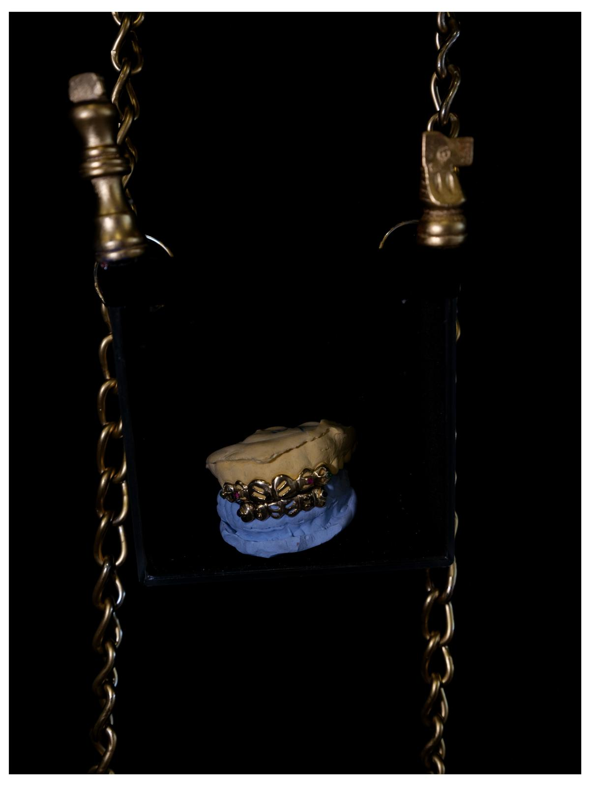
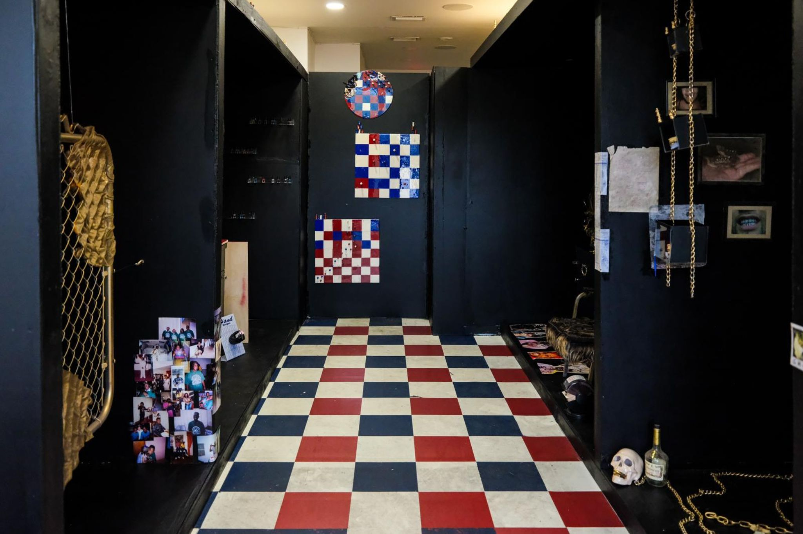

On March 13th, 2019, Flea Market USA closed its doors after over 30 years of business. With its checkered red, white, and blue flooring and its bright, neon signs, Flea Market USA was lined with vendors of local Liberty City businesses offering anything from batteries to donuts. Or, better said by artist Shayla Marshall, it was a place where “You could get your hair done, your nails done, your grills done and leave looking like a new person”. Born, Bred, and Sheddin’ the Souf is a love letter to the nostalgia of this era in Liberty City’s history, the black community of South Florida, and, by default, a reclamation against the ever-increasing encroachments from gentrifiers currently surrounding them.

This exhibition is organized by Femme Continuum, a new artist residency program led by local curator and arts advocate Heaven Jones. Since last October, Jones and Marshall have been incubating this project together, reimagining Flea Market USA specifically through the lens of Grills, Hair, Nails, and Family Name as central themes. Each theme is represented in a different booth built out into the interior of International Cuts, Jones’s aunt’s salon, and a staple in Liberty City.

For Hair, Marshall leads the task by creating the latest iteration of her hair furniture pieces, of which the earlier works were exhibited in London during Marshall’s master studies at the Royal College of Art. Marshall uses synthetic hair pieces, tracks, and adhesive to overtake the furniture pieces in hair, giving the impression of intricate embroidery that is growing out of the furniture’s upholstery. While the earlier works seemed to be made from ornate antiques, this latest iteration titled The First Lady (2025) is made from a (still functional) 70’s hair drier chair. On the chair’s headpiece, which is where someone would put their head to get their hair dried, Marshall has attached a bust that is completely covered in neatly arranged braids. The bust dons a wig of its own. Along the floor are images of some incredibly intricate and outlandish hairstyles that emulate the time, one of which is a large red beehive wig entirely made of shapely curls, and another is a red and black wig with a motorcycle figurine built into it. The section oozes the swag and originality that makes black women one of, if not the most mimicked, derived, and influential groups in contemporary American aesthetic sensibilities.

Facing the Hair, the Nails section features work by Heaven Jones herself, in her first exhibition as an artist and curator. Several acrylic nail display boards line along an airbrushed desk and some parts of the floor, featuring hand casts that look as if they are reaching out from the boards themselves. Each cast- titled Pressure. Press-her. Press on. (2025) as a series- is made from the hands of different women, be it Jones’s god sister, godmother, Shayla Marshall, or Jones’s best friend. They embody the life cycle of womanhood with rich symbolism. The work that grounds this section of the installation is a mixed media collage, with over 1200 red acrylic nails, childhood images of Jones and her grandmother, and pages from the Bible, Psalm Magic by Anna Riva, and Hood Feminism by Mikki Kendall. Grandma’s Hands (2025) is an ambitious work that ties Jones to the lineage of the women in her family, represents her explorations of selfhood and spirituality, and references the adultification and early sexualization of young, black girls. When sharing her work, Jones recited an empowering quote written on one of the pages, one that places her at the vanguard of her family history and Black Southern lineage: “My grandmother is a praying woman, my mother is a praying woman, and I am a woman of practice”.

The front two sections are dedicated to Family Name (on the left) and Grills (on the right). The Family Name section features a wall installation of family t-shirts, a tradition for special occasions like birthdays, funerals, and graduations. One shirt comes from Jones’s collection, from a celebration of her grandmother's 90th birthday. What a blessing it is to have a matriarch lead a family well into her 90s, as is the case with this grandma, who lived another 7 years after that party. In front of the shirts hangs a golden fence with a lock of hair embroidered over the top and two t-shirts suspended in resin, The Pearly Gates (2025); the title is a sort of double entendre, referencing heaven itself and the several railings that family would hang balloons or decorations from during these festivities. It is a reminder of the incredible heart of these communities, far from the harmful stereotypes of absent parents and misguided violence that the media would have people believe forms the ethos of the Black familial experience. The grills featured on the opposite side are made by a famous local family of grill masters, Lando Golds, the inventors of the removable grill. Lando Golds was one of the mainstays of Flea Market USA, and one of the businesses with the good fortune to adapt once the space shut down, while others now face homelessness after losing grip on their thriving local enterprises. Phil Norville is the latest generation of this grill-making family, bringing forth works that show incredible craftsmanship and sensibility; one grill even features what looked like a Venetian cameo on the canine tooth. The story here goes beyond simple grills because it is a story of legacy, with several generations keeping up the traditions of a family business.

Outside of these different booths, viewers will notice a chess motif play out throughout the installation. Form chess pieces lining the tops of the different stands, to chess mixed media assemblage pieces hanging from the surrounding walls, to the checkered flooring that is both a chess reference and a reference to the original flooring of Flea Market USA. The chess motif is integrated from Marshall’s practice, where she explores the idea of life, politics, and society as a big chess game. She imagines fantasies where the pawns of the world can circumvent the rules like the kings and queens do, where they can out-strategize and outmaneuver their way through tough positions. The pieces express a certain recognition of the inherent unfairness of our world and hope for what the disadvantaged can do with enough wits and savvy. Certainly, in a neighborhood like Liberty City, locals will continue to have to pay their chessboard as well as they can if they hope to keep their hometown, as developers, gentrifiers, and transplants snap at their heels.

Born, Bred, and Sheddin’ the Souf is currently on view Monday to Friday 11-6 pm, Saturday and Sunday by appointment at International Cuts INC. The exhibition comes down on February 8th but is looking to travel to other local spaces. For more information about the exhibition and pending programming, follow @femme.continuum, curator Heaven Jones @frankoceanmuseum, or artist Shayla Marshall @shaylamonii.

SAVE THE DATE:

What: Born, Bred, and Sheddin’ the Souf

When: Jan 18, 2025 - Feb 8, 2025Time: M- F 11-6 pm, Sat and Sun by appointment  

Where: 630 NW 62nd St, Miami, FL 33150

List of events:

January 27th: Group Panel - South Florida Artist (“Expanding During Displacement: Not Asking for Permission)

January 30th: Artist Talk

February 2nd: Family Day | “Souf Roots: Art, Stories, and Connection”

February 8th | Closing Night