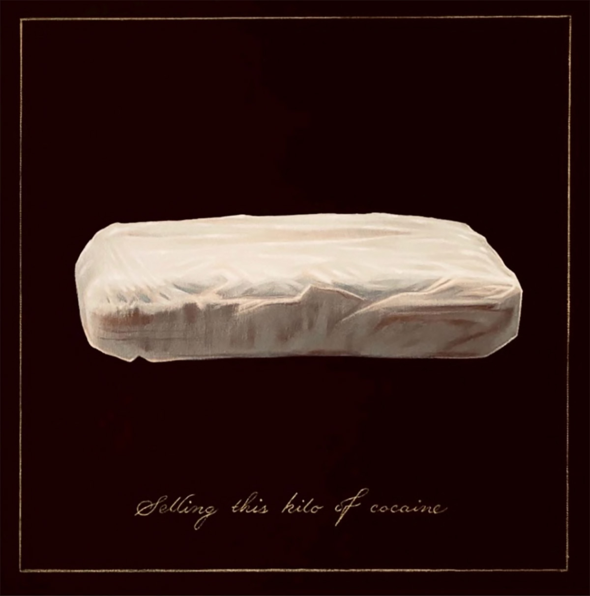
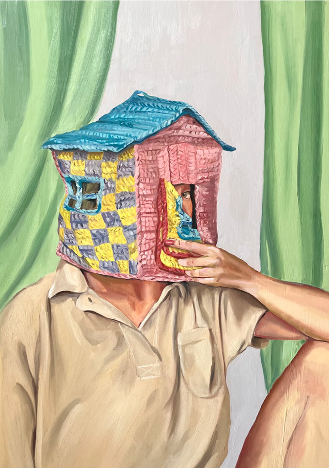
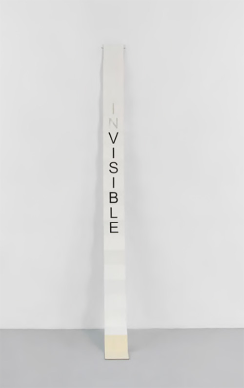
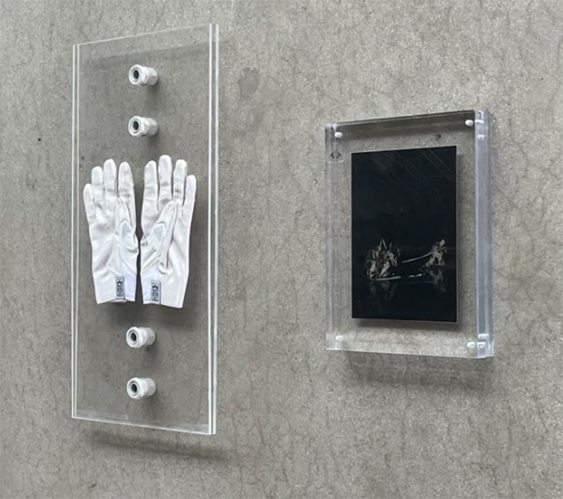
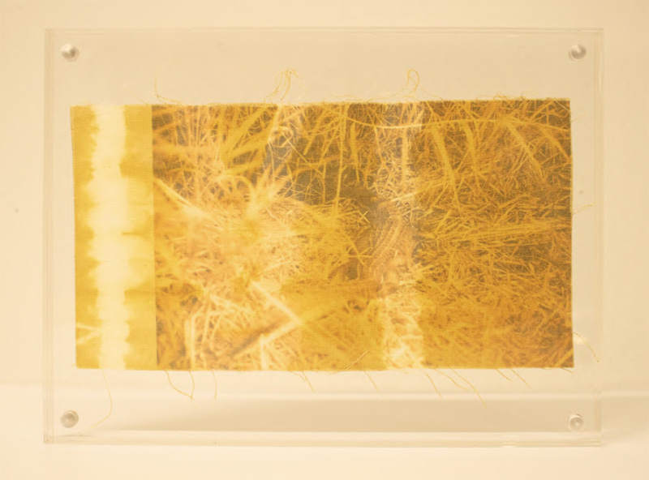
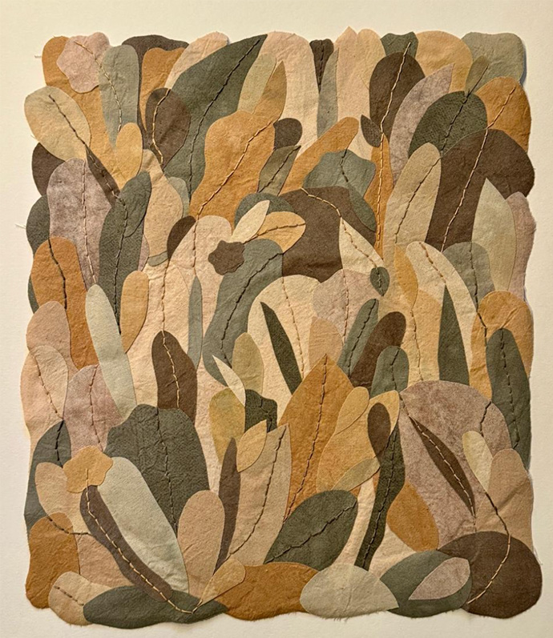

For the person who has paid attention to the Miami art community, the Friends of Laundromat exhibition may feel like a homecoming party. After all, it features several artists who have either made their home in the city or have regularly exhibited and partaken in our corner of the contemporary art world. 

This exhibition features the work of 19 artists, who will line the main entrance and hallway walls between the studio spaces of 14 creatives whose practices already find home in the Laundromat Art Space. The work, much like the participating artists, runs the gamut on subject matter, medium, and background. The one thread each piece shares in common is location; they all are somehow tied to Laundromat, and, as such, to Miami. Seeing the many perspectives expressed through this group show, which range from self-portrait paintings of a woman wearing a textile hat sculpture (Stay Soft, 2024, Kristina Reinis), to abstract silk threading, so thinly layered and stretched that they almost look airbrushed (Marisa Telleria), I am reminded of how wrong visitors are when they assume that the local art is monolithic. Yes, some themes tie many locals together, like ethnic origins, immigrant backgrounds, or even something as banal as enjoying the beach. However, if a simple group show at a local artist studio can express such diversity of practice, it is by default representative of a dynamic and equally varied visual arts community in South Florida.

Javier Martin’s “Words Matter" artist books are a great example of the diversity at play in this exhibition. These books unfold like accordions that hang on one side onto the wall, featuring a marsupial word of Martin’s choice. One such word is INvisible (2023), where the letters that spell “Visible” are painted onto Japanese rice paper, while the I and the N are cut out. Martin is expressing paradox in language, selectively choosing words that have hidden their own antonym. Something about the work reminds me of the “SHE BELIEVED” meme’s and t-shirts of the mid to late 2010’s; they have a certain conceptualist whimsy that is at once introspective into our day-to-day vocabulary and tongue-in-cheek. Beyond that, I would be hard-pressed to find installation pieces like these that are even remotely as easy to transport or install. 

David Correa’s Death Catalyst Gloves and Still from the Machining of the Fool (2024) memorializes a medium that often does not get its due attention in Miami, performance art. Two white gloves and a small, monochromatic photograph hang next to one another in acrylic casing. Part of the beauty of performance is its ephemerality, one can try to recreate or maintain the work through audiovisual resources or recreations, but neither will ever be the same as the experience of an artist's performance as they are doing it. These works do the job of giving permanence to part of the performance, but in a more abstract and inventive fashion rather than a simple video.

This review would be incomplete without highlighting the work in this exhibition that ties mediums to origin. Artists like Diana Eusebio and Fernanda Froes bring forth work that mixes ancient heritage and contemporary visuality; through their respective treatments of natural pigmentation and personal history, they weave their ethnic origins (South America and the Caribbean) into the greater context of Miami as a Latin American hub. Their work is deeply grounding, in a spiritual and spatial sense. It is also a reminder of the fiber art community that has continued to grow throughout the city, led by women artists who reclaim this medium as more than just a domestic craft.

Juan Pablo Bohorquez’s Selling This Kilo of Cocaine (2023) literally made me laugh out loud when I saw it. There is nothing funny about drug trafficking, the violence it brings to Miami, or how addiction can ruin people’s lives, but this play on Magritte’s Ceci n’est pas une pipe hits a chord with me that I cannot help but find hilarious. Perhaps those of us (local or not) who have had late nights in the many seedy bars, or cheesy, shiny nightclubs that line Miami’s coast, or who have worked high-intensity jobs with a boss with a liiiiiittle too much energy for a Monday at 8:30 AM can relate to this feeling of desensitized, fucked up comedy. Regardless of whether Bohorquez meant for this piece to be comedic or not, this Kilo of Cocoaine will certainly not be the last one for sale in Miami, especially not during Art Miami Week. 

Friends of Laundromat is the latest of a series of exhibitions developed with the help of Ross Karlan and Sophia Ballesteros, who, as resident curators, have helped director Ronald Sanchez to expand Lauromat's commitment to incubating emerging talent beyond the studio artists themselves. When asked about who this exhibition is aimed at, they highlighted young collectors looking to purchase friendly-priced work from rising stars. I would challenge that perception. Instead, widen the horizon by saying that this is an exhibition for anyone, local or not, who would like to peek into a microcosm of the magic that goes on during Art Miami Week in an approachable, yet still very official context. As a whole, this exhibition reads like a mini art fair, from the curation to the selection of artists, to its commercially minded approach. If you are curious about what Miami Art Week is all about, I would recommend you come to Lauromat this season to view, discuss, and, yes, even collect art without feeling gatekept or breaking the bank. 

SAVE THE DATE:

What: Friends of Laundromat, exhibition opening at Laundromat Art Space
‍When: Opening: December 1, 12 - 5 PM. Afterwards open 12 - 7 during Miami Art Week and will be participating in Little Haiti Little River Art Days on Dec 7 from 12 - 5 pm
‍Time: from 12-5pm
‍Where: Laundromat Art Space 185 NE 59th Street Miami, FL 33137
‍More Info: https://www.laundromatartspace.com/contact